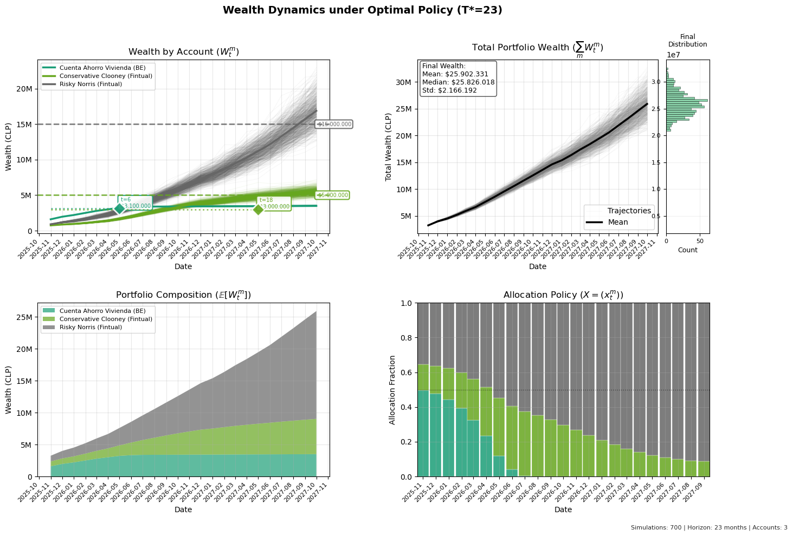
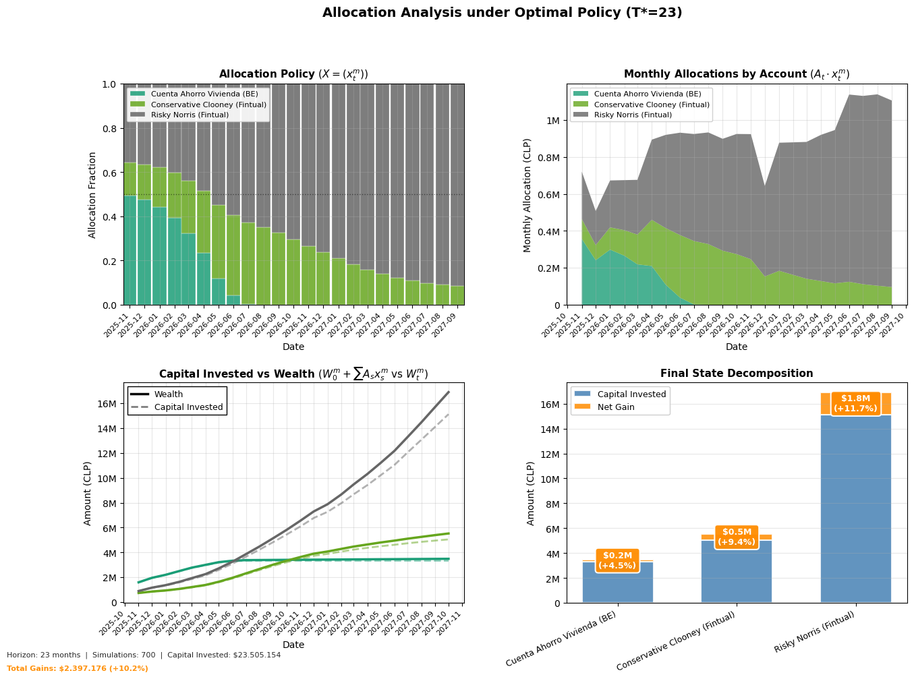

# FinOpt

[](https://www.python.org/downloads/)
[](https://opensource.org/licenses/MIT)
[](https://github.com/psf/black)
[](tests/)

> **Minimum-horizon portfolio optimization with probabilistic goal guarantees**

Find the shortest investment horizon to achieve your financial goals using CVaR-reformulated convex programming and Monte Carlo simulation.

**Why FinOpt?** Traditional tools either use heuristics (suboptimal), gradient descent (local minima), or simulation without optimization (no decisions). FinOpt combines stochastic simulation with convex optimization for **globally optimal allocation policies**.


*Monte Carlo wealth trajectories under optimal allocation policy with goal achievement markers*

---

## Problem Statement

**Core question**: *What is the minimum investment horizon T\* to achieve multiple financial goals with high probability?*

Traditional approaches fall short:
- **Heuristic rules** (60/40 portfolio, constant rebalancing) → suboptimal allocations
- **Gradient-based optimization** → local minima, no global guarantees
- **Pure Monte Carlo** → scenario analysis without decision support

**FinOpt's approach**: Bilevel stochastic optimization

```
Outer: min T                              # Find shortest horizon
Inner: max f(X)                           # Objective (wealth, turnover, risk-adjusted)
       s.t. X ∈ Simplex                   # Allocation policy
            P(W_t ≥ goal_t) ≥ 1-ε, ∀ goals    # Goal constraints
            P(W_t ≥ D_t) ≥ 1-δ, ∀ withdrawals  # Withdrawal feasibility
```

The key insight: Using **CVaR reformulation** (Rockafellar & Uryasev, 2000), non-convex chance constraints become convex, enabling global optimality via disciplined convex programming (DCP).

---

## Key Features

### Mathematical Rigor
- **Affine wealth representation**: Closed-form dynamics expose linear structure for convex solvers
- **CVaR reformulation**: Transforms probabilistic constraints into tractable epigraphic form
- **Global optimality**: DCP-compliant objectives (CVXPY) eliminate local minima

### Practical Capabilities
- **Multiple goals**: Intermediate (fixed time) + terminal (optimized horizon)
- **Scheduled withdrawals**: Calendar-based cash outflows with feasibility constraints
- **Stochastic withdrawals**: Uncertain withdrawals with floor/cap bounds
- **Stochastic income**: Seasonality, noise, growth, floor/cap constraints
- **Correlated returns**: Multi-asset portfolios with lognormal shocks
- **Flexible objectives**: Terminal wealth, low turnover, risk-adjusted, balanced

---

## Visual Showcase

### Income Projection with Seasonality

*Stochastic variable income (gray trajectories) + deterministic fixed income with scheduled raises*

### Allocation Analysis with Investment Gains

*Capital invested vs wealth decomposition: $23.3M contributions → $27.9M final wealth (+19.7%)*

---

## Quick Start

### Installation

#### Option 1: Conda (Recommended)

```bash
git clone https://github.com/mfourier/finopt.git
cd finopt

conda env create -f environment.yml
conda activate finance
pip install -e .
```

#### Option 2: pip

```bash
git clone https://github.com/mfourier/finopt.git
cd finopt

python -m venv .venv
source .venv/bin/activate  # Windows: .venv\Scripts\activate
pip install -r requirements.txt
pip install -e .
```

#### Verify Installation

```bash
python -c "from src import FinancialModel; print('FinOpt installed successfully')"
pytest tests/ -q  # Run test suite
```

**Core dependencies**: numpy, pandas, cvxpy (ECOS/SCS solvers), matplotlib, scipy, pydantic

### Minimal Example

> **Note**: Examples use Chilean Peso (CLP) but FinOpt is currency-agnostic. Scale values appropriately for your local currency.

```python
from src import FinancialModel, Account, IncomeModel, FixedIncome
from src.goals import TerminalGoal
from src.optimization import CVaROptimizer
from datetime import date

# 1. Define income stream
income = IncomeModel(
    fixed=FixedIncome(
        base=1_500_000,  # Monthly salary
        annual_growth=0.03,
        salary_raises={date(2026, 6, 1): 500_000}
    )
)

# 2. Configure accounts
accounts = [
    Account.from_annual(
        name="Conservative Fund",
        annual_return=0.08,
        annual_volatility=0.09,
        initial_wealth=1_000_000
    ),
    Account.from_annual(
        name="Aggressive Fund",
        annual_return=0.14,
        annual_volatility=0.15,
        initial_wealth=500_000
    )
]

# 3. Create model
model = FinancialModel(income, accounts)

# 4. Define goal
goals = [
    TerminalGoal(
        account="Aggressive Fund",
        threshold=5_000_000,
        confidence=0.80  # 80% success probability
    )
]

# 5. Optimize
optimizer = CVaROptimizer(n_accounts=2, objective="balanced")
result = model.optimize(
    goals=goals,
    optimizer=optimizer,
    T_max=120,
    n_sims=500,
    seed=42
)

print(f"Minimum horizon: T*={result.T} months")
print(f"Objective value: {result.objective_value:.4f}")

# 6. Visualize
model.plot("wealth", result=result, show_trajectories=True)
```

**Output:**
```
=== GoalSeeker: BINARY search T in [1, 120] ===
[Iter 1] Testing T=60... Feasible
[Iter 2] Testing T=30... Feasible
[Iter 3] Testing T=15... Infeasible
[Iter 4] Testing T=23... Feasible
=== Optimal: T*=23 (converged in 7 iterations) ===
```

### Interactive Notebooks

| Notebook | Description |
|----------|-------------|
| [FinOpt-Workflow.ipynb](notebooks/FinOpt-Workflow.ipynb) | Complete workflow: income, simulation, optimization, visualization |
| [01-profile-builder.ipynb](notebooks/01-profile-builder.ipynb) | Profile builder: income, portfolio, return|
| [02-scenario-optimizer.ipynb](notebooks/02-scenario-optimizer.ipynb) | Scenario builder: goals, withdrawal, optimization|

---

## Architecture

```
┌─────────────────────────────────────────────────┐
│           FinancialModel (Facade)               │
│  - Orchestration layer                          │
│  - Unified plotting interface                   │
│  - Simulation caching                           │
└───────┬─────────────────────────────────────────┘
        │
        ├──► IncomeModel ──┬──► FixedIncome
        │                  └──► VariableIncome
        │
        ├──► WithdrawalModel ──┬──► WithdrawalSchedule (deterministic)
        │                      └──► StochasticWithdrawal (uncertain)
        │
        ├──► ReturnModel (Lognormal correlations)
        │
        ├──► Portfolio (Wealth dynamics executor)
        │       W_{t+1} = (W_t + A_t·x_t - D_t)(1 + R_t)
        │
        └──► GoalSeeker ───┬──► AllocationOptimizer
                           │       └─► CVaROptimizer (CVXPY)
                           └──► GoalSet (validation)
```

**Module responsibilities:**

| Module | Purpose | Key Abstractions |
|--------|---------|------------------|
| `income.py` | Cash flow modeling | `FixedIncome`, `VariableIncome`, `IncomeModel` |
| `withdrawal.py` | Cash outflow modeling | `WithdrawalEvent`, `StochasticWithdrawal`, `WithdrawalModel` |
| `returns.py` | Stochastic shocks | `ReturnModel` (correlated lognormal) |
| `portfolio.py` | Wealth dynamics | `Account`, `Portfolio` (affine executor) |
| `goals.py` | Objective specification | `IntermediateGoal`, `TerminalGoal`, `GoalSet` |
| `optimization.py` | Convex solvers | `CVaROptimizer`, `GoalSeeker` |
| `model.py` | Orchestration | `FinancialModel` (facade), `SimulationResult` |

---

## Mathematical Foundation

### Wealth Dynamics

For account $m$ with allocation policy $X = \{x_t^m\}$ and withdrawals $D_t^m$:

$$
W_{t+1}^m = (W_t^m + A_t \cdot x_t^m - D_t^m)(1 + R_t^m)
$$

**Affine representation** (closed-form for optimization):

$$
W_t^m(X) = W_0^m \cdot F_{0,t}^m + \sum_{s=0}^{t-1} (A_s \cdot x_s^m - D_s^m) \cdot F_{s,t}^m
$$

where $F_{s,t}^m = \prod_{\tau=s}^{t-1}(1 + R_\tau^m)$ are accumulation factors.

**Key property**: $W_t^m$ is **affine in $X$** → convex constraints remain convex.

### CVaR Reformulation

Original chance constraint (non-convex):

$$
\mathbb{P}(W_t^m \geq b) \geq 1 - \varepsilon
$$

CVaR reformulation (convex):

$$
\text{CVaR}_\varepsilon(b - W_t^m) \leq 0
$$

where:

$$
\text{CVaR}_\varepsilon(L) = \min_{\gamma} { \gamma + \frac{1}{\varepsilon N}\sum_{i=1}^N [L_i - \gamma]_+ }
$$

**Epigraphic form** (LP-compatible):

$$
\begin{align}
\gamma + \frac{1}{\varepsilon N}\sum_{i=1}^N z_i &\leq 0 \\
z_i &\geq b - W_t^m(\omega^{(i)}) - \gamma, \quad \forall i \\
z_i &\geq 0, \quad \forall i
\end{align}
$$

**Theorem (Rockafellar & Uryasev, 2000)**: CVaR ≤ 0 **implies** P(W ≥ b) ≥ 1-ε (conservative approximation with global optimality).

### Bilevel Optimization

**Outer problem** (horizon search):
```
min T ∈ ℕ
s.t. inner problem is feasible
```

**Inner problem** (allocation):
```
max f(X)
s.t. Σ_m x_t^m = 1, ∀t                        [Simplex constraint]
     x_t^m ≥ 0, ∀t,m                           [Non-negativity]
     ℙ(W_t^m(X) ≥ b_t^m) ≥ 1-ε_t^m, ∀ intermediate goals
     ℙ(W_T^m(X) ≥ b^m) ≥ 1-ε^m, ∀ terminal goals
     ℙ(W_t^m(X) ≥ D_t^m) ≥ 1-δ, ∀ withdrawals  [Withdrawal feasibility]
```

**Objective functions** $f(X)$:

| Objective | Formula | Type | Use Case |
|-----------|---------|------|----------|
| `"risky"` | $\mathbb{E}\left[\sum_m W_T^m\right]$ | LP | Maximum wealth accumulation |
| `"balanced"` | $-\sum_{t,m}(\Delta x_{t}^m)^2$ | QP | Stable allocations (minimize turnover) |
| `"conservative"` | $\mathbb{E}[W_T] - \lambda \cdot \text{Std}(W_T)$ | QP | Risk-averse mean-variance |
| `"risky_turnover"` | $\mathbb{E}[W_T] - \lambda \cdot \sum_{t,m}(\Delta x_{t}^m)^2$ | QP | Wealth + stability tradeoff |

where $\Delta x_t^m = x_t^m - x_{t-1}^m$ is the allocation change (turnover).

The probabilistic constraints are reformulated via CVaR:
```
CVaR_ε(b_g - W_{t_g}) ≤ 0, ∀g  [Goals via CVaR]
CVaR_δ(D_t^m - W_t^m) ≤ 0, ∀ withdrawals  [Withdrawal feasibility via CVaR]
```

**Solution method**: Binary search with warm-start (O(log T) iterations vs O(T) linear).

---

## Usage Examples

### Example 1: Multiple Goals with Different Horizons

```python
from src.goals import IntermediateGoal, TerminalGoal

goals = [
    # Emergency fund by month 6
    IntermediateGoal(
        month=6,
        account="Savings Account",
        threshold=3_000_000,
        confidence=0.95  # High confidence for safety net
    ),
    # House down payment by month 18
    IntermediateGoal(
        month=18,
        account="Conservative Fund",
        threshold=10_000_000,
        confidence=0.80
    ),
    # Retirement goal (horizon to be optimized)
    TerminalGoal(
        account="Aggressive Fund",
        threshold=50_000_000,
        confidence=0.70
    )
]

result = model.optimize(goals, optimizer, T_max=240)

# Verify goal satisfaction
verification = model.verify_goals(result, goals)
for goal_id, status in verification.items():
    print(f"{goal_id}: {status['status']} (margin: {status['margin']:.1%})")
```

### Example 2: Stochastic Income with Seasonality

```python
from src import VariableIncome

# Freelance income with summer peak
variable = VariableIncome(
    base=800_000,
    seasonality=[0.5, 0.5, 0.8, 1.0, 1.2, 1.5,  # Jan-Jun (summer high)
                 1.5, 1.2, 1.0, 0.8, 0.5, 0.5], # Jul-Dec (winter low)
    sigma=0.15,  # 15% monthly noise
    floor=0,     # Can have zero income months
    cap=2_000_000,
    annual_growth=0.05
)

income = IncomeModel(
    fixed=FixedIncome(base=2_000_000, annual_growth=0.03),
    variable=variable,
    monthly_contribution={
        "fixed": [0.4] * 12,    # Save 40% of fixed
        "variable": [1.0] * 12  # Save 100% of variable
    }
)
```

### Example 3: Risk-Adjusted Objectives

```python
from src.optimization import CVaROptimizer

# Compare different risk preferences
objectives = ["risky", "balanced", "conservative"]
results = {}

for obj in objectives:
    optimizer = CVaROptimizer(n_accounts=3, objective=obj)
    results[obj] = model.optimize(goals, optimizer, T_max=120, seed=42)
```

### Example 4: Scheduled Withdrawals

```python
from datetime import date
from src.withdrawal import WithdrawalModel, WithdrawalSchedule, WithdrawalEvent, StochasticWithdrawal

# Define withdrawal schedule
withdrawals = WithdrawalModel(
    scheduled=WithdrawalSchedule([
        # Bicycle purchase in June 2025
        WithdrawalEvent(
            account="Conservative Fund",
            amount=400_000,
            date=date(2025, 6, 1),
            description="Bicycle purchase"
        ),
        # Vacation in December 2026
        WithdrawalEvent(
            account="Aggressive Fund",
            amount=2_000_000,
            date=date(2026, 12, 1),
            description="Family vacation"
        ),
    ]),
    stochastic=[
        # Emergency fund with uncertainty
        StochasticWithdrawal(
            account="Conservative Fund",
            base_amount=500_000,
            sigma=100_000,
            date=date(2025, 9, 1),
            floor=300_000,
            cap=800_000
        )
    ]
)

# Simulate with withdrawals
result = model.simulate(
    T=36,
    n_sims=500,
    seed=42,
    withdrawals=withdrawals
)

# Optimize with withdrawal constraints
result = model.optimize(
    goals=goals,
    optimizer=optimizer,
    T_max=120,
    n_sims=500,
    withdrawals=withdrawals
)
```

**Withdrawal constraints**: The optimizer ensures $\mathbb{P}(W_t^m \geq D_t^m) \geq 1-\delta$ (default $\delta=0.05$, i.e., 95% confidence that wealth covers withdrawals).

---

## Testing

FinOpt includes comprehensive unit and integration tests:

```bash
# Full test suite
pytest tests/ -v

# With coverage report
pytest tests/ --cov=src --cov-report=term-missing

# Integration tests only (full optimization workflow)
pytest tests/integration/ -v

# Quick smoke test
pytest tests/unit/test_portfolio.py -v -k "affine"
```

**Test structure**:
- `tests/unit/` - Module-level tests for all 9 core modules
- `tests/integration/` - End-to-end workflow tests
- `tests/conftest.py` - Shared fixtures (accounts, income models, goals)

---

## Roadmap

- [ ] **Robust optimization**: Uncertainty sets for (μ, σ) parameters
- [ ] **Historical backtesting**: Real fund return data

---

## References

**Optimization Theory**:
- Rockafellar, R.T. & Uryasev, S. (2000). "Optimization of Conditional Value-at-Risk". *Journal of Risk*, 2(3), 21-41.
- Shapiro, A., Dentcheva, D., & Ruszczyński, A. (2014). *Lectures on Stochastic Programming*. SIAM.

---

## Contributing

Contributions are welcome. Please:

1. Fork the repository
2. Create a feature branch (`git checkout -b feature/amazing-feature`)
3. Ensure tests pass (`pytest tests/`)
4. Format code (`black src/ tests/`)
5. Submit a pull request

**Development setup**:
```bash
pip install -e ".[dev]"  # Installs black, pytest, pytest-cov
```

---

## License

MIT License - see [LICENSE](LICENSE) for details.

---

## Author

**Maximiliano Lioi**
M.Sc. Applied Mathematics | Quantitative Finance | Data Science

[GitHub](https://github.com/mfourier) | [LinkedIn](https://linkedin.com/in/mlioi)

---

*This software is for educational and research purposes. Not financial advice. Consult certified professionals before making investment decisions.*
