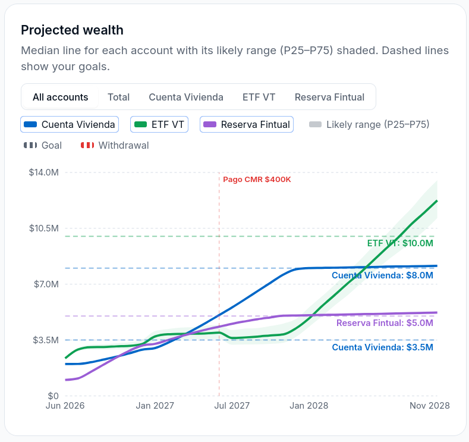

# FinOpt

[](https://www.python.org/downloads/)
[](https://github.com/mfourier/finopt/actions/workflows/test.yml)
[](tests/)
[](https://github.com/astral-sh/ruff)
[](LICENSE)

> **Goal-based portfolio optimization via CVaR-reformulated convex programming**

FinOpt inverts the classical planning question: instead of *"given horizon T, what wealth can I achieve?"*, it solves *"what is the minimum horizon T\* to achieve my goals with probabilistic guarantees?"*

---

## Mathematical Foundation

### Minimum-Horizon Problem

FinOpt finds the smallest horizon at which the goals are *simultaneously achievable*, then the best allocation at that horizon:

$$T^\star = \min\{\,T \in \mathbb{N} : \mathcal{F}(T) \neq \varnothing\,\}, \qquad \mathcal{F}(T) = \bigl\{\,X \in \Delta^T : \mathbb{P}\!\left(W_t^m(X) \geq b_t^m\right) \geq 1 - \varepsilon_t^m \;\; \forall \text{ goals}\,\bigr\}$$

$$X^\star = \arg\min_{X \in \mathcal{F}(T^\star)} f(X)$$

where $\Delta^T = \{X \in \mathbb{R}_{\geq 0}^{T \times M} : \mathbf{x}_t^\top \mathbf{1} = 1,\; \forall t\}$ is the allocation simplex over $M$ accounts. Equivalently, as one program with $T$ as the sole objective:

$$\min_{T \in \mathbb{N},\; X \in \Delta^T} \; T \qquad \text{s.t.} \quad \mathbb{P}\!\left(W_t^m(X) \geq b_t^m\right) \geq 1 - \varepsilon_t^m \quad \forall \text{ goals}$$

Here $T^\star$ is fixed by feasibility alone, and the secondary objective $f(X)$ — turnover, expected wealth, or mean–variance (see the [objective table](#quick-start) below) — only selects *which* optimal-horizon policy to deploy.

`GoalSeeker` runs the outer search over $T$ — `linear` (sequential, safest), `binary` (≈50% fewer iterations, assumes monotonicity), or `bracketed` (two-sided galloping from a computed bracket) — using the inner convex program's solver status (`OPTIMAL` vs `INFEASIBLE`) as the feasibility oracle for $\mathcal{F}(T)$. The inner program, $\min_X f(X)$ subject to the CVaR constraints below, is solved by CVXPY.

### CVaR Reformulation

Chance constraints are non-convex. Rockafellar & Uryasev (2000) establish that CVaR is a sufficient condition:

$$\mathrm{CVaR}_\varepsilon(b - W) \leq 0 \implies \mathbb{P}(W \geq b) \geq 1 - \varepsilon$$

The CVaR constraint admits an exact LP epigraph form over $N$ Monte Carlo scenarios:

$$\gamma + \frac{1}{\varepsilon N} \sum_{i=1}^{N} z_i \leq 0, \qquad z_i \geq b - W^i - \gamma, \quad z_i \geq 0$$

The full problem becomes a linear (or quadratic) program in $(\gamma, z_1, \ldots, z_N, X)$, solvable to **global optimality**. The implication is one-directional — CVaR is conservative — so the empirical success rate typically exceeds the specified confidence level; both are reported for transparency.

### Affine Wealth Representation

Wealth is affine in $X$, which is what makes the CVaR constraint a tractable convex constraint:

$$W_t^m(X) = W_0^m \cdot F_{0,t}^m + \sum_{s=0}^{t-1} \bigl(A_s\, x_s^m - D_s^m\bigr) \cdot F_{s,t}^m$$

where $F_{s,t}^m = \prod_{\tau=s+1}^{t}(1 + R_\tau^m)$ are stochastic accumulation factors pre-computed from Monte Carlo paths. This gives analytic gradients $\nabla_{x_s^m} W_t^m = A_s \cdot F_{s,t}^m$ and preserves convexity of any DCP-compliant objective.


*Monte Carlo wealth trajectories under the optimal allocation policy $X^\*$*

---

## Quick Start

```bash
conda env create -f environment.yml && conda activate finance
pip install -e .
```

```python
from finopt import FinancialModel, Account, IncomeModel, FixedIncome
from finopt.goals import TerminalGoal
from finopt.optimization import CVaROptimizer

income = IncomeModel(fixed=FixedIncome(base=1_500_000, annual_growth=0.03))
accounts = [
    Account.from_annual("Conservative", annual_return=0.08, annual_volatility=0.09),
    Account.from_annual("Aggressive",   annual_return=0.14, annual_volatility=0.15),
]
model = FinancialModel(income, accounts)
goals = [TerminalGoal(account="Aggressive", threshold=5_000_000, confidence=0.80)]

optimizer = CVaROptimizer(n_accounts=2, objective="balanced")
result = model.optimize(goals=goals, optimizer=optimizer, T_max=120, n_sims=500, seed=42)

print(f"Minimum horizon: T* = {result.T} months")
model.plot("wealth", result=result, show_trajectories=True)
```

The `objective` parameter controls the inner optimization program:

| Value | Formulation | Use case |
|-------|-------------|----------|
| `"balanced"` | $-\sum_{t,m}(\Delta x_{t,m})^2$ | Stable allocations (default) |
| `"risky"` | $\mathbb{E}[\sum_m W_T^m]$ | Maximum wealth accumulation |
| `"conservative"` | $\mathbb{E}[W_T] - \lambda\,\mathrm{Std}(W_T)$ | Risk-averse mean-variance |
| `"risky_turnover"` | $\mathbb{E}[W_T] - \lambda\sum(\Delta x)^2$ | Wealth + stability tradeoff |

### Command-line interface

Installing the package exposes a `finopt` console script for config-driven runs:

```bash
finopt simulate --config examples/basic_config.json   # Monte Carlo simulation
finopt optimize --config examples/basic_config.json --goals examples/basic_goals.json
finopt config validate examples/basic_config.json     # validate a config
finopt report ...                                     # reports from saved results
finopt info                                           # system / package info
```

Run `finopt COMMAND --help` for command-specific options.

---

## Project Structure

```
finopt/
├── src/finopt/          # Core library
│   ├── income.py        # Stochastic income (seasonality, noise, growth)
│   ├── returns.py       # Correlated lognormal return model
│   ├── portfolio.py     # Wealth dynamics (recursive + affine)
│   ├── goals.py         # Goal types, chance-constraint evaluation
│   ├── optimization.py  # CVaROptimizer + GoalSeeker (horizon search)
│   ├── model.py         # FinancialModel facade
│   ├── withdrawal.py    # Scheduled and stochastic cash outflows
│   ├── plotting.py      # Visualization suite
│   ├── config.py        # Pydantic type-safe configuration
│   ├── serialization.py # JSON model/result persistence
│   └── cli.py           # `finopt` command-line interface
├── api/                 # FastAPI backend — async jobs, Supabase persistence
├── web/                 # React/Vite frontend
├── supabase/            # SQL schema and migrations
├── notebooks/           # Jupyter workflow examples
├── examples/            # Sample config and goal files
├── docs/                # MkDocs site and figures
└── tests/               # 911 tests · 85% coverage
```

---

## Development

```bash
# Run tests with coverage
pytest tests/ --cov=src

# Lint
ruff check src/ api/ tests/
```

CI runs on every push via GitHub Actions (`.github/workflows/test.yml`).

---

## References

- Rockafellar, R.T. & Uryasev, S. (2000). *Optimization of Conditional Value-at-Risk*. Journal of Risk, 2(3), 21–41.
- Shapiro, A., Dentcheva, D., & Ruszczyński, A. (2014). *Lectures on Stochastic Programming*. SIAM.

---

## License

MIT — see [LICENSE](LICENSE).

**Maximiliano Lioi** — M.Sc. Applied Mathematics  
[GitHub](https://github.com/mfourier) · [LinkedIn](https://linkedin.com/in/mlioi)

---

*For educational and research purposes. Not financial advice.*
