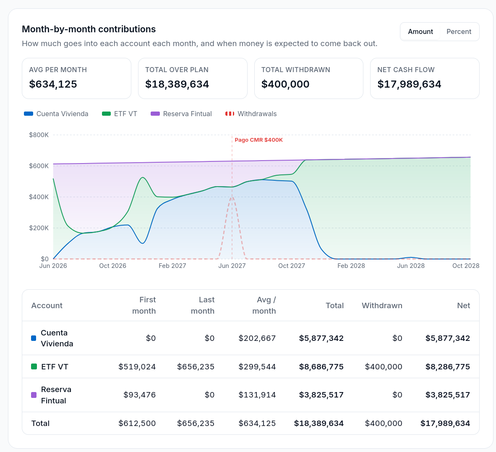

# FinOpt

[](https://www.python.org/downloads/)
[](https://github.com/astral-sh/ruff)
[](LICENSE)

> **Goal-based portfolio optimization via CVaR-reformulated convex programming**

FinOpt is a portfolio planning toolkit built around one question: instead of asking "given horizon T, what wealth can I achieve?", it asks "what is the minimum horizon T* to achieve my goals with probabilistic guarantees?"

Today the repository contains three layers:

- A Python library for simulation and CVaR-based optimization.
- A FastAPI compute service that runs jobs and persists results in Supabase.
- A React/Vite frontend for profiles, scenarios, and result exploration.

---

## Current Status

The current repo is best understood as a full-stack app backed by the original optimization library.

- `src/finopt/`: simulation, goal modeling, optimization, plotting, serialization.
- `api/`: FastAPI service with `/health`, `/simulate`, and `/optimize`.
- `web/`: authenticated frontend built with React, Vite, React Query, and Supabase.
- `supabase/`: SQL schema, migrations, and seed data for local/cloud projects.
- `run-local.sh`: recommended local entrypoint for running API + web together.

If you only want the research/library side, you can still use `finopt` directly from Python. If you want the product experience reflected by the repo today, start with the local app flow below.

---

## Quick Start

### Run the app locally

1. Create env files:

```bash
cp .env.example .env
cp web/.env.example web/.env
```

2. Fill in your Supabase values in `.env` and `web/.env`.

You need a Supabase project for local app usage. The frontend is auth-protected and will redirect to `/login` until you sign in with that project, and the compute API expects authenticated requests tied to Supabase jobs.

3. Start everything:

```bash
./run-local.sh --install
```

This starts:

- API: `http://localhost:8000`
- API docs: `http://localhost:8000/docs`
- Frontend: `http://localhost:5173`

The script installs Python dependencies from `finopt[web]`, installs the frontend packages, and launches both dev servers together.

### Installation options

Use the flavor that matches what you want to do:

```bash
# Core Python library only
pip install -e .

# Library + CLI
pip install -e ".[cli]"

# Library + FastAPI compute service
pip install -e ".[web]"

```

If you prefer the Conda environment defined in the repo:

```bash
conda env create -f environment.yml
conda activate finance
pip install -e .
```

Note: `environment.yml` only installs a small scientific Python base. It does not install the `finopt` package or optional extras by itself.

### Python example

```python
from finopt import FinancialModel, Account, IncomeModel, FixedIncome
from finopt.goals import TerminalGoal
from finopt.optimization import CVaROptimizer

income = IncomeModel(fixed=FixedIncome(base=1_500_000, annual_growth=0.03))
accounts = [
    Account.from_annual("Conservative", annual_return=0.08, annual_volatility=0.09),
    Account.from_annual("Aggressive", annual_return=0.14, annual_volatility=0.15),
]
model = FinancialModel(income, accounts)
goals = [TerminalGoal(account="Aggressive", threshold=5_000_000, confidence=0.80)]

optimizer = CVaROptimizer(n_accounts=2, objective="proportional")
result = model.optimize(goals=goals, optimizer=optimizer, T_max=120, n_sims=500, seed=42)

print(f"Minimum horizon: T* = {result.T} months")
model.plot("wealth", result=result, show_trajectories=True)
```

Run `finopt COMMAND --help` for command-specific options.

Important: the CLI currently supports fixed-horizon optimization via `--horizon`. The minimum-horizon goal-seeking flow is available in the Python API and the app/backend, but is not fully wired into the CLI yet.

### Optimization objectives

The `objective` parameter controls the inner optimization program:

| Value | Formulation | Use case |
|-------|-------------|----------|
| `"proportional"` | $-\sum_{t,m}(x_{t,m} - 1/M)^2$ | Even, stable monthly split - keeps every account funded (default) |
| `"balanced"` | $-\sum_{t,m}(\Delta x_{t,m})^2$ | Stable allocations (turnover penalty only) |
| `"risky"` | $\mathbb{E}[\sum_m W_T^m]$ | Maximum wealth accumulation |
| `"conservative"` | $\mathbb{E}[W_T] - \lambda \mathrm{Std}(W_T)$ | Risk-averse mean-variance |
| `"risky_turnover"` | $\mathbb{E}[W_T] - \lambda\sum(\Delta x)^2$ | Wealth + stability tradeoff |

---

## Project Structure

```text
fin-opt/
├── src/finopt/          # Core simulation and optimization library
├── api/                 # FastAPI compute service
├── web/                 # React/Vite frontend
├── supabase/            # Migrations and seed data
├── examples/            # Sample configs, goals, and demos
├── notebooks/           # Research / exploratory workflows
├── docs/                # MkDocs source
├── docker/              # Dockerfiles for API/web
├── run-local.sh         # Recommended local dev entrypoint
├── render.yaml          # Render deployment blueprint
└── pyproject.toml       # Python package + tool configuration
```

---

## Mathematical Foundation

### Minimum-Horizon Problem

FinOpt finds the smallest horizon at which the goals are *simultaneously achievable*, then the best allocation at that horizon:

$$T^\star = \min\lbrace T \in \mathbb{N} : \mathcal{F}(T) \neq \varnothing \rbrace$$

$$\mathcal{F}(T) = \lbrace X \in \Delta^T : \mathbb{P}\left(W_t^m(X) \geq b_t^m\right) \geq 1 - \varepsilon_t^m \quad \forall \text{ goals} \rbrace$$

$$X^\star = \arg\min_{X \in \mathcal{F}(T^\star)} f(X)$$

where $\Delta^T = \lbrace X \in \mathbb{R}_{\geq 0}^{T \times M} : \mathbf{x}_t^\top \mathbf{1} = 1, \forall t \rbrace$ is the allocation simplex over $M$ accounts. Equivalently, as one program with $T$ as the sole objective:

$$\min_{T \in \mathbb{N}, X \in \Delta^T} \quad T \qquad \text{s.t.} \quad \mathbb{P}\left(W_t^m(X) \geq b_t^m\right) \geq 1 - \varepsilon_t^m \quad \forall \text{ goals}$$

Here $T^\star$ is fixed by feasibility alone, and the secondary objective $f(X)$ — an even-split diversification anchor (default), turnover, expected wealth, or mean–variance (see the [objective table](#optimization-objectives) below) — only selects *which* optimal-horizon policy to deploy.

`GoalSeeker` runs the outer search over $T$ — `linear` (sequential, safest), `binary` (≈50% fewer iterations, assumes monotonicity), or `bracketed` (two-sided galloping from a computed bracket) — using the inner convex program's solver status (`OPTIMAL` vs `INFEASIBLE`) as the feasibility oracle for $\mathcal{F}(T)$. The inner program, $\min_X f(X)$ subject to the CVaR constraints below, is solved by CVXPY.

### CVaR Reformulation

Chance constraints are non-convex. Rockafellar & Uryasev (2000) establish that CVaR is a sufficient condition:

$$\mathrm{CVaR}_\varepsilon(b - W) \leq 0 \implies \mathbb{P}(W \geq b) \geq 1 - \varepsilon$$

The CVaR constraint admits an exact LP epigraph form over $N$ Monte Carlo scenarios:

$$\gamma + \frac{1}{\varepsilon N} \sum_{i=1}^{N} z_i \leq 0, \qquad z_i \geq b - W^i - \gamma, \quad z_i \geq 0$$

The full problem becomes a linear (or quadratic) program in $(\gamma, z_1, \ldots, z_N, X)$, solvable to **global optimality**. The implication is one-directional — CVaR is conservative — so the empirical success rate typically exceeds the specified confidence level; both are reported for transparency.

### Affine Wealth Representation

Wealth follows a recursive law: each period the start-of-period wealth, plus the contribution allocated to account $m$, minus any withdrawal, compounds at the realized return.

$$W_{t+1}^m = \left(W_t^m + A_t\, x_t^m - D_t^m\right)\left(1 + R_t^m\right)$$

Unrolling this recursion from $W_0^m$ yields a closed form that is **affine in the allocation policy** $X$ — which is what makes the CVaR constraint a tractable convex constraint:

$$W_t^m(X) = W_0^m \cdot F_{0,t}^m + \sum_{s=0}^{t-1} \left(A_s x_s^m - D_s^m\right) \cdot F_{s,t}^m$$

where $F_{s,t}^m = \prod_{\tau=s+1}^{t}(1 + R_\tau^m)$ are stochastic accumulation factors pre-computed from Monte Carlo paths. This gives analytic gradients $\nabla_{x_s^m} W_t^m = A_s \cdot F_{s,t}^m$ and preserves convexity of any DCP-compliant objective.


*Monte Carlo wealth trajectories under the optimal allocation policy $X^\*$*


*Optimal allocation policy $X^\*$*

---

## References

- Rockafellar, R. T., & Uryasev, S. (2000). *Optimization of Conditional Value-at-Risk*. *Journal of Risk*, 2(3), 21-41.
- Nemirovski, A., & Shapiro, A. (2007). *Convex Approximations of Chance Constrained Programs*. *SIAM Journal on Optimization*, 17(4), 969-996.
- Mínguez, R., & Díaz-Cachinero, P. (2025). *Convex Risk Control with Exact Probabilities: The CVaR-Chance-Constraint Approach*. Working paper, Statistics and Econometrics, 2025-05. [PDF](https://e-archivo.uc3m.es/rest/api/core/bitstreams/42c28941-c1b5-400c-bc35-cbb3fe75750a/content)

---

## License

MIT — see [LICENSE](LICENSE).

**Maximiliano Lioi** — M.Sc. Applied Mathematics  
[Repository](https://github.com/mlioi/fin-opt) · [LinkedIn](https://linkedin.com/in/mlioi)

---

*For educational and research purposes. Not financial advice.*
